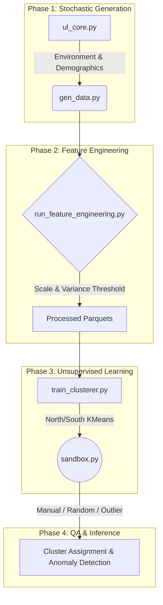

# 🌊 HydroLoom AI - Behavior Clusterer Service

> **Next-Generation Unsupervised Learning for Environmental Behavioral Modeling**

HydroLoom AI is an advanced, open-source unsupervised learning service that models and clusters household water consumption behaviors. By leveraging distinct K-Means clustering pipelines for Northern and Southern Hemispheres, HydroLoom uncovers subtle behavioral profiles driven by environmental variance, appliance efficiency, and landscape demand.

---

## 🏗️ Architecture

HydroLoom’s pipeline is built for reproducibility and scale, dynamically moving from stochastic data generation to high-dimensional feature engineering and clustering.



---

## 📊 Results & Analysis

For a comprehensive technical report on the clustering results, consumer archetypes, and visual distributions, please refer to the full analysis document:

📄 **[Read the Full Unsupervised Learning Analysis](ANALYSIS.md)** *(Includes executive summary, archetype profiles, and downstream impacts for predictive/prescriptive phases)*

---

## 🚀 The HydroLoom Sandbox

The **HydroLoom Sandbox** (`sandbox.py`) is the core evaluation environment for this service. It provides a real-time interactive terminal to test, stress, and QA the unsupervised models. 

### Why the Sandbox?
The sandbox allows researchers and contributors to inject synthetic or extreme behavioral profiles into the pre-trained models. The system evaluates the profile's distance to existing cluster centroids and actively flags anomalies (distance > 5.0) that fall outside the learned distribution.

### Sandbox Input Features
1. **Log Per Capita Usage** - Logarithmic scaling of physiological and domestic water intake.
2. **Dry Day Spike Factor** - Behavioral response during prolonged dry spells.
3. **Efficiency Penalty Ratio** - The degradation multiplier based on household appliance age and maintenance.
4. **Landscape Demand Index** - Weighted coefficient mapping property type to evaporation deficit.

---

## ⚡ Quickstart: Local Environment Setup

Follow these steps to seamlessly configure your local environment, generate the datasets, train the models, and drop straight into the sandbox.

```bash
# 1. Clone the repository and enter the directory
git clone https://github.com/tuboa2/hydroloom-ai.git
cd hydroloom-ai

# 2. Initialize a secure Python virtual environment
python -m venv .venv
source .venv/bin/activate  # Windows: .venv\Scripts\activate

# 3. Install core dependencies
pip install -r requirements.txt

# 4. Launch the interactive AI Sandbox
python sandbox.py
```

---

## 📓 Notebooks & Google Colab

The `notebooks/` directory contains in-depth Jupyter notebooks for exploratory data analysis (EDA), univariate/multivariate analysis, and cluster exploration. 

> [!NOTE]
> **Google Colab Runtime**
> The Jupyter notebooks in this repository are explicitly designed and optimized to be run using the **Google Colab Server** as the primary runtime. When exploring or executing the notebooks, please ensure you are connected to a Colab backend for seamless execution and dependency management.

---

## 🤖 Agentic Integrations & Workflows

HydroLoom is natively designed to integrate with modern AI orchestration and execution environments.

> [!TIP]
> **BlockRun Integration**
> Use BlockRun to programmatically execute `sandbox.py` in isolated ephemeral containers. BlockRun can pipe programmatic inputs (Option 3: "Extreme Outlier Profile") in a loop to rapidly stress-test the bounds of the clustering logic without manual intervention.

> [!TIP]
> **Google Antigravity Workflows**
> Deploy Antigravity subagents to conduct parallel QA runs on the Sandbox. Subagents can parse the distance metrics outputted by the terminal, cross-reference them against expected thresholds, and automatically document newly discovered edge cases or "failure modes" into the repository.

---

## 🤝 Open Source Contribution Guidelines

Please read the [CONTRIBUTION.md](CONTRIBUTION.md) for details on my code of conduct, and the process for discovering anomalies, filing issues, and submitting pull requests to the project.
---

<div align="center">
  <i>Designed for the future of environmental AI.</i>
</div>
