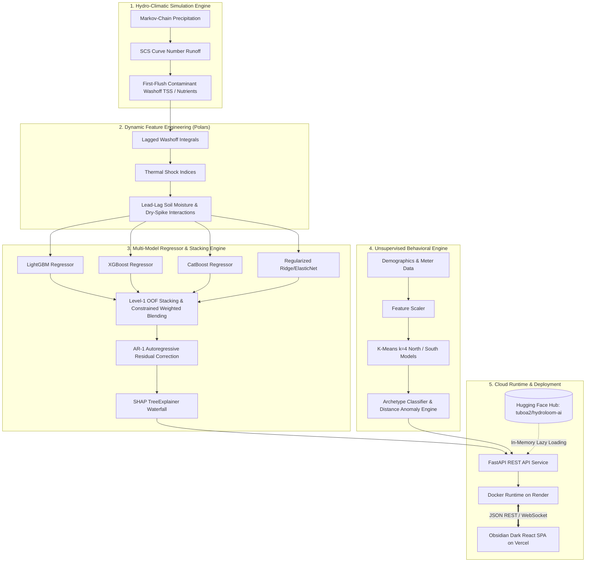

# 🌊 Hydroloom AI

<div align="center">

**Continuous AI-Driven Water Quality Index Intelligence, Hydro-Climatic Simulation, and Consumer Behavioral Analytics**

[](https://www.python.org/)
[](https://fastapi.tiangolo.com/)
[](https://react.dev/)
[](https://vitejs.dev/)
[](https://huggingface.co/tuboa2/hydroloom-ai)
[](https://www.docker.com/)
[](https://docs.pytest.org/)
[](LICENSE)

</div>

---

## 📌 Executive Overview

**Hydroloom AI** is a production-grade machine learning and environmental intelligence platform designed to forecast continuous **Water Quality Index (WQI)** scores, simulate stochastic hydro-climatic rainfall washoff kinetics, and classify consumer behavioral demand profiles.

Built on an asynchronous microservices architecture, Hydroloom bridges physical hydrology (SCS Curve Number runoff, Markov precipitation transitions) with ensemble gradient boosting and Level-1 Out-of-Fold (OOF) meta-learning.

---

## 🏗️ System Architecture


```mermaid
flowchart TB
    subgraph Physical_Simulation["1. Hydro-Climatic Simulation Engine"]
        A[Markov-Chain Precipitation] --> B[SCS Curve Number Runoff]
        B --> C[First-Flush Contaminant Washoff TSS / Nutrients]
    end

    subgraph Feature_Engineering["2. Dynamic Feature Engineering (Polars)"]
        C --> D[Lagged Washoff Integrals]
        D --> E[Thermal Shock Indices]
        E --> F[Lead-Lag Soil Moisture & Dry-Spike Interactions]
    end

    subgraph ML_Ensemble["3. Multi-Model Regressor & Stacking Engine"]
        F --> G1[LightGBM Regressor]
        F --> G2[XGBoost Regressor]
        F --> G3[CatBoost Regressor]
        F --> G4[Regularized Ridge/ElasticNet]
        
        G1 & G2 & G3 & G4 --> H[Level-1 OOF Stacking & Constrained Weighted Blending]
        H --> I[AR-1 Autoregressive Residual Correction]
        I --> J[SHAP TreeExplainer Waterfall]
    end

    subgraph Behavioral_Clustering["4. Unsupervised Behavioral Engine"]
        K[Demographics & Meter Data] --> L[Feature Scaler]
        L --> M[K-Means k=4 North / South Models]
        M --> N[Archetype Classifier & Distance Anomaly Engine]
    end

    subgraph Production_Deployment["5. Cloud Runtime & Deployment"]
        J & N --> O[FastAPI REST API Service]
        P[(Hugging Face Hub: tuboa2/hydroloom-ai)] -. In-Memory Lazy Loading .-> O
        O --> Q[Docker Runtime on Render]
        Q <==>|JSON REST / WebSocket| R[Obsidian Dark React SPA on Vercel]
    end
```

---

## 🌟 Key Features & Capabilities

### 1. Supervised Water Quality Index (WQI) Forecasting
- **Multi-Model Regression**: Evaluates LightGBM, XGBoost, CatBoost, and Linear Baselines across Northern and Southern hemisphere climatic regimes.
- **Level-1 Stacking & Weighted Blending**: Meta-regressors optimize out-of-fold variance, achieving $R^2 > 0.94$ with continuous confidence bounds ($\pm 1.96\sigma$).
- **Dynamic SHAP Explanations**: Real-time TreeExplainer breakdown computes per-feature attributions (rainfall, TSS, nutrient load, temperature) for every prediction.
- **Physical Washoff Remediation Advisories**: Generates automated operational recommendations (coagulant dosing, wetland detention routing, aerator activation) based on WQI degradation severity.

### 2. Physical Hydrological Simulation
- **Markov Chain Weather Generation**: Multi-state transition matrices model wet-to-dry spells and extreme storm events across 30-day to 365-day horizons.
- **SCS Runoff & Washoff Kinetics**: Models soil moisture antecedent conditions (AMC I/II/III) and exponential pollutant accumulation during dry periods.
- **Continuous Multi-Layer Visualizations**: Synchronized time-series charts rendering daily precipitation pulses against WQI trajectory curves.

### 3. Consumer Behavioral Demand Clustering
- **4-Archetype K-Means Clustering ($k=4$)**:
  - 🌿 **Conservationist**: High efficiency, low baseline consumption, stable dry-spell discipline.
  - 🏡 **Average Household**: Balanced domestic usage with moderate seasonal variance.
  - 🌳 **Landscape Heavy**: High outdoor irrigation demand with pronounced dry-day spikes.
  - 🚨 **High Volume / Leaker**: Persistent tier-violation volumes and severe fixture degradation.
- **Interactive 4D Radar Charts**: Dynamic SVG spider charts mapping Per Capita Usage, Dry Day Spikes, Appliance Efficiency Penalties, and Landscape Demand.

### 4. Obsidian Glassmorphism UI Suite
- **100% Lucide React SVG Standard**: Zero raw emojis in UI controls for an enterprise-grade finish.
- **Ultra-Lightweight Bundle**: Stripped legacy DAG dependencies, trimming production JS down to **266 kB** (77 kB gzip).
- **Responsive Mission Control**:
  - 🛰️ **WQI Mission Control Studio**: Climate presets, dual-tone range sliders, and animated circular WQI gauges.
  - 🕸️ **Behavioral Clustering Sandbox**: Real-time archetype classification and conservation rebate triggers.
  - 📈 **Simulation Studio**: Multi-month climate scenario testing with glass KPI metrics.
  - 🏆 **Model Benchmark Leaderboard**: Candidate regressor telemetry and causal feature stability rankings.
  - 💬 **Community Notes Modal**: Worldwide scenario feedback feed with local persistence.

---

## 📦 Hugging Face Model Repository

All model weights, scalers, preprocessor pipelines, SHAP explainers, metrics, and documentation are hosted on the **Hugging Face Hub**:

🔗 **Repository**: [https://huggingface.co/tuboa2/hydroloom-ai](https://huggingface.co/tuboa2/hydroloom-ai)

### Loading Models in Python
```python
from huggingface_hub import hf_hub_download
import joblib

# Download and load the North Hemisphere K-Means model
model_path = hf_hub_download(
    repo_id="tuboa2/hydroloom-ai",
    repo_type="model",
    filename="clustering_models/kmeans_north_k4.joblib"
)
kmeans_model = joblib.load(model_path)
```

---

## 🚀 Quickstart & Local Setup

### Prerequisites
- Python 3.12+
- Node.js 20+ & `pnpm`
- Git

### 1. Clone the Repository
```bash
git clone https://github.com/tuboa2/hydroloom-ai.git
cd hydroloom-ai
```

### 2. Backend Setup
```bash
# Create and activate virtual environment
python -m venv .venv
source .venv/bin/activate  # Windows: .venv\Scripts\activate

# Install Python dependencies
pip install -r requirements.txt

# Start the FastAPI development server
uvicorn services.wqi_predictor.deployment.api:app --host 0.0.0.0 --port 8000 --reload
```

### 3. Frontend Setup
```bash
cd app
pnpm install
pnpm run dev
```
Open [http://localhost:5173](http://localhost:5173) in your browser.

---

## 🐳 Docker Deployment

The backend includes a hardened, multi-stage Dockerfile configured for non-root execution (`appuser:appgroup`, UID `10001`) and dynamic port binding:

```bash
# Build the Docker image
docker build -t hydroloom-api:latest .

# Run the container
docker run -p 8000:8000 -e PORT=8000 hydroloom-api:latest
```

*Memory Footprint: **~155 MB RSS** (Optimized for Render Free Tier 512 MB ceiling).*

---

## 📡 REST API Reference

| Method | Endpoint | Description |
| :--- | :--- | :--- |
| `GET` | `/health` | Service liveness, RSS memory telemetry, loaded models |
| `GET` | `/ping` | Lightweight zero-latency heartbeat |
| `POST` | `/api/v1/predict/wqi` | Predict WQI score with confidence interval and SHAP decomposition |
| `POST` | `/api/v1/cluster/predict` | Classify consumer behavior archetype and distance anomaly score |
| `POST` | `/api/v1/simulate` | Run multi-horizon stochastic rainfall and washoff simulation (30d–365d) |
| `GET` | `/api/v1/models/metadata` | Retrieve candidate regressor benchmark rankings and feature importances |
| `POST` | `/api/v1/feedback` | Submit validation feedback note with star rating |
| `GET` | `/api/v1/feedback` | List community feedback stream |

### Example: WQI Prediction Request
```bash
curl -X POST "http://localhost:8000/api/v1/predict/wqi" \
     -H "Content-Type: application/json" \
     -d '{
       "hemisphere": "north",
       "daily_rainfall_mm": 45.0,
       "daily_max_temp": 28.5,
       "antecedent_moisture_condition": 3,
       "total_suspended_solids_mg_l": 120.0,
       "nutrient_load_index": 72.0,
       "consecutive_dry_days": 14,
       "consumer_demand_cluster": 2,
       "model_family": "stacking_ensemble"
     }'
```

---

## 🧪 Test Suite & Quality Assurance

Hydroloom maintains a strict multi-tier automated test harness covering unit tests, physical simulations, deployment configurations, and headless browser interactions:

```bash
# Run all 241 automated tests
pytest tests/
```

```text
============================= test session starts ==============================
collected 241 items

tests/e2e/test_frontend_e2e.py .                                         [  0%]
tests/sims/cluster.py ........................................           [ 17%]
tests/sims/interactions.py ...                                           [ 18%]
tests/sims/macro_behavior.py ...                                         [ 19%]
tests/sims/precipitation.py ...........................................  [ 37%]
tests/sims/runoff.py ...........................                         [ 48%]
tests/sims/wqi.py ..                                                     [ 49%]
tests/unit/ensemble.py ..................................                [ 63%]
tests/unit/feature_engineer.py ..........                                [ 67%]
tests/unit/model.py .....                                                [ 69%]
tests/unit/preprocess.py ..........                                      [ 73%]
tests/unit/selection.py ...............                                  [ 80%]
tests/unit/test_api.py .......                                           [ 82%]
tests/unit/test_api_comprehensive.py ................................    [ 96%]
tests/unit/test_deployment_config.py .....                               [ 98%]
tests/unit/test_hf_loader.py ....                                        [100%]

================= 241 passed, 14 warnings in 128.19s (0:02:08) =================
```

---

## 📄 License & Contributing

- **Documentation**: Detailed guides are available in [`docs/architecture.md`](docs/architecture.md), [`docs/methodology.md`](docs/methodology.md), and [`docs/evaluation.md`](docs/evaluation.md).
- **Contributing**: Please review [`CONTRIBUTION.md`](CONTRIBUTION.md) for contribution guidelines and code of conduct.
- **License**: Released under the [MIT License](LICENSE).

<div align="center">
  <sub>Designed for the future of environmental AI and resilient hydrological intelligence.</sub>
</div>
