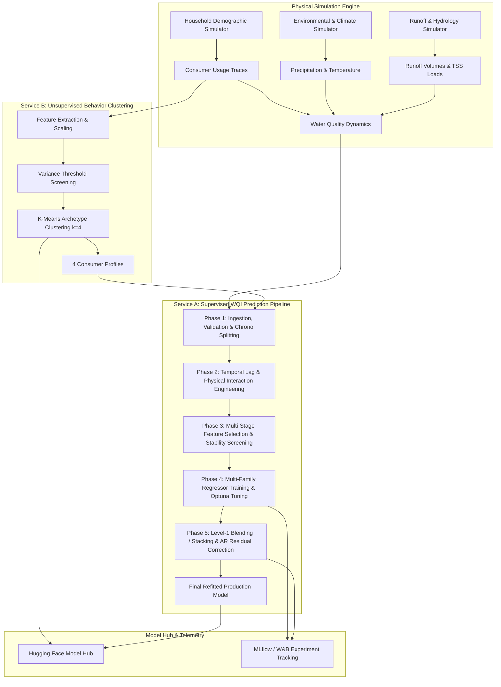

# System Architecture Documentation

## 1. System Overview

**HydroMind** (packaged as `hydroloom`) is a modular data science and machine learning framework designed for urban water system simulation, consumer behavioral clustering, and water quality index (WQI) forecasting. The system integrates physical hydrological simulation with unsupervised pattern discovery and high-precision supervised ensemble prediction.

---

## 2. Multi-Agent System Topology

The architecture follows a strict **Orchestrator/Router Pattern** with isolated responsibilities:

1. **Orchestrator / Pipeline Runner (`scripts/run_pipeline.py`)**:
   - Manages workflow dependency execution across Phases 1 through 5.
   - Enforces execution gates and schema handoffs between intermediate stages.
   - Logs metrics and error states centrally.

2. **Data Ingestion & Processing Agent (`services/wqi_predictor/data/`)**:
   - Ingests raw parquet partitions and validates schemas (`validator.py`).
   - Implements chronological time-series splitting (`splitter.py`): 3-year Train (Years 1-3, 1,095 days), 1-year Validation (Year 4, 365 days), 1-year Test (Year 5, 365 days).
   - Monitors population stability index (PSI) for covariate shift (`drift.py`).

3. **Feature Engineering & Selection Agent (`services/wqi_predictor/features/`, `selection/`)**:
   - Constructs physical interaction terms, cumulative drought indices, and causal temporal lags.
   - Applies hemisphere-isolated feature isolation (North vs. South).
   - Executes multi-stage stability selection and family ablation.

4. **Modeling & Ensemble Agent (`services/wqi_predictor/models/`, `ensemble/`)**:
   - Trains diverse model families: LightGBM, XGBoost, CatBoost, and ElasticNet / Ridge.
   - Optimizes loss functions: RMSE, Huber, Log-Cosh, Quantile, and MAE.
   - Constructs out-of-fold level-0 matrices, constrained non-negative blend weights, Ridge stacking meta-learners, and autoregressive residual error correctors.

5. **Deployment & Model Management Agent (`services/wqi_predictor/deployment/`)**:
   - Packages model weights, preprocessors, metadata manifests, and SHAP plots.
   - Generates standardized Model Cards and publishes artifacts to the Hugging Face Model Hub.
   - Provides transparent runtime model loading via `huggingface_hub`.

---

## 3. Directory Layout & Module Boundaries

| Directory / Module | Role | Key Components |
|---|---|---|
| `services/behavior_clustering/` | Unsupervised Service | Data loader, feature extractor, variance selector, KMeans models (`kmeans_north_k4.joblib`, `kmeans_south_k4.joblib`). |
| `services/wqi_predictor/` | Supervised Service | Core prediction pipelines, feature registry, models, tuning, ensemble, and explainability. |
| `services/wqi_predictor/deployment/` | Deployment Tooling | `hf_hub.py` (packager & deployer), `hf_loader.py` (runtime downloader). |
| `scripts/` | Execution Entrypoints | `run_pipeline.py`, `deploy_to_hf.py`, `gen_data.py`, `setup.py`, `feature_engineer.py`, `selection.py`, `model.py`, `ensemble.py`. |
| `scripts/sims/` | Simulation Engine | `precipitation.py`, `runoff.py`, `household.py`, `environment.py`, `macro_behavior.py`, `interactions.py`, `wqi.py`. |
| `notebooks/` | Analytical Explorations | `notebooks/clustering/` (01-05), `notebooks/wqi_prediction/` (01-03). |
| `tests/` | Verification Suite | `tests/unit/` (supervised unit tests), `tests/sims/` (simulation physics tests). |
| `docs/` | Technical Documentation | `architecture.md`, `methodology.md`, `evaluation.md`. |
| `analysis-results/` | Output Metrics | Profiling CSVs, anomaly score tables, causal drivers. |
| `artifacts/` | Model Artifacts | Checkpoints, SHAP explanations, reports, manifests. |

---

## 4. Anti-Leakage & Governance Invariants

- **Chronological Time Splitting**: Time-series order is strictly preserved. No future data is ever permitted into training or feature scaling transformations.
- **Out-of-Fold (OOF) Level-1 Training**: Stacking and blending meta-learners are trained strictly on out-of-fold validation predictions to prevent target leakage.
- **Locked Test Set Access Guard**: Test set features and targets are locked behind a cryptographic access receipt (`test_guard.py`) and only evaluated once the final ensemble strategy is frozen.
- **Dynamic Path Resolution**: Root paths resolve relative to `Path(__file__).resolve().parents[2]` ensuring cross-platform container and host portability.
